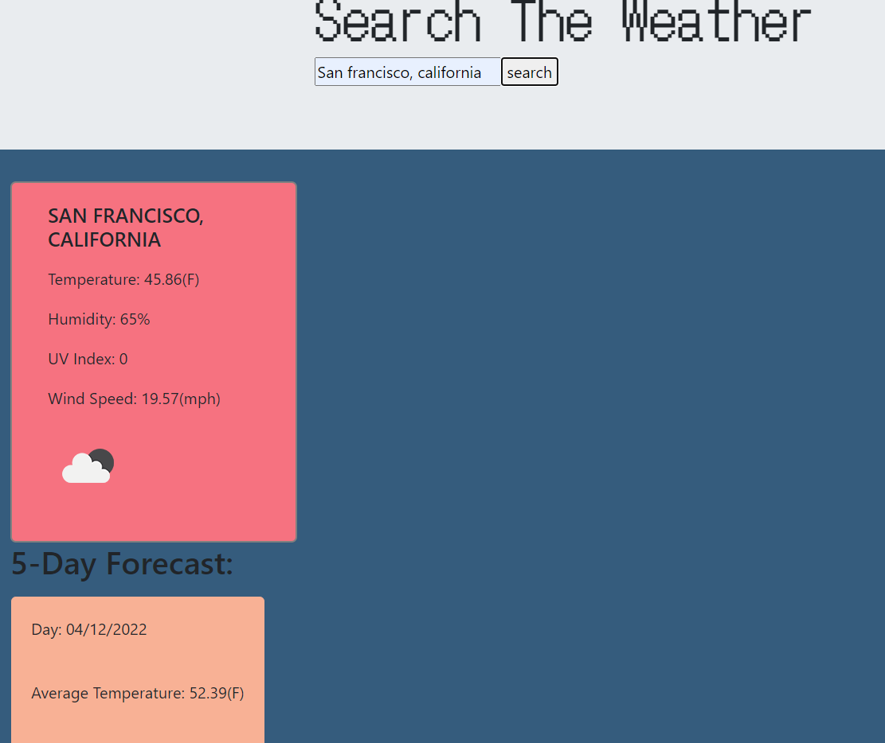

# weatherDashboard

## Description
My app queries openweathermap.org. I am doing two queries in this app, one to the One Call API (consisting of all weather data by longitude and latitude) and the other called Geocaching api (given a city or country name it will produce their longitude and latitude). I utilized geocaching to get the longitude and latitude of the city or country that is entered into the search bar. This immediately is used to get the One Call api to query the weather for that geographical area. 

Given the responses from One Call API, I can then query the specific information from the API object. In this case I took temperature, humidity, UV index, and wind speed. For the five day forcast I included date, average temperature, and humidity.


[Link to the Website](https://sambalogna.github.io/weatherDashboard/)

## Key Coding Snippets

The bulk of this project was done once I was able to query the geocaching api and set paramaters for a new url using the One Call API. I would then take the response and insert it into a function called updatePage. 
````Javascript
function getLonLat(response) {
    longitude = response[0].lon
    latitude = response[0].lat
    function buildQueryURL(){
        var queryURL = "https://api.openweathermap.org/data/2.5/onecall?"
        var queryParams = {  
        };
        queryParams.lat = response[0].lat;
        queryParams.lon = response[0].lon;
        queryParams.units = "imperial"
        //console.log(queryParams.units)
        queryParams.appid = "10a435f0f1bcc2310fbd0c0b7e3018c3"
        //console.log(queryParams.appid)
    
       //console.log(queryURL+$.param(queryParams));
        return queryURL+$.param(queryParams)
    }
        var queryURL = buildQueryURL();
        $.ajax({ url: queryURL, method:"GET"}).then(updatePage)
````

The function continues, but this portion is the area where I save the last inputted search to history. The search unfortunately is grabbing your last search which will cause issues with the naming of the buttons created for each history input. Clicking twice on search will give you two history buttons with the cities' names on them. The one inputted more recently will have the proper stored date. 
```` Javascript
    //clicking once will save the PREVIOUS SESSIONS HISTORY TO THE CURRENTLY SEARCHED CITY HISTORY.Clicking search a second time for the currently displayed location
    //will correctly save the output to a history tab. 
    $("#btnInput").on("click", saveQuery);
    function saveQuery(){
        console.log(queryURL)
        var queryURLSave = queryURL
        if (queryURLSave) {
            localStorage.setItem('query', queryURLSave);
        }     
    }
    var querySave = localStorage.getItem('query')
    //console.log(querySave)
    //console.log(localStorage)

    $("section").after('<div><button id="lastSearch">'+ geoParams.q+'</button></div>')
    $("#lastSearch").on("click",function(){
        $.ajax({url:querySave, method:"GET"}).then(updatePage)
    })
} 
````
Within updatePage() I have a second function that takes the response given to update page and iterates the daily weather into five blocks. 
````JavaScript
    function fiveDay() {
        for(var i=5;i>0;i--){
            var day = response.daily[i].dt
            var realTime = moment.unix(day).format("MM/DD/YYYY")
           $(".card").after('<div class="fiveDay"><div class="card-body"><div class="day'+[i]+'">Day: '+ realTime +'</div></div>'+
           '<div class="card-body"><div class="temp'+[i]+'">Average Temperature: '+response.daily[i].temp.day+'(F)</div></div>' +
           '<div class="card-body"><div class="humidity'+[i]+'">Humidity: '+response.daily[i].humidity+'%</div></div></div>')
        }
        $(".card").after("<h2>5-Day Forecast: </h2>")
    }
fiveDay();     
 }
````